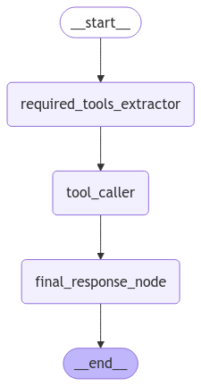

# Solana Agent Toolkit Interface

An intelligent AI-powered interface for interacting with the Solana blockchain, featuring both CLI and Streamlit web applications. This project uses LangChain and Groq to provide natural language processing capabilities for Solana blockchain operations.

Demo link: https://drive.google.com/file/d/1icfC9zZ_lqcZRLVnKVftRh8gmRFUGdgr/view?usp=sharing

## 🚀 Features

- Natural language processing for Solana blockchain operations
- Multiple interface options (CLI and Web UI)
- Support for various Solana operations:
  - Token deployment
  - Balance checking
  - Token transfers
  - Trading operations
  - Flash trades
  - Lending operations
- Error handling with intelligent feedback
- Async operation support
- Structured conversation flow using LangGraph

## 🛠️ Tech Stack

### Core Technologies
- Python 3.13
- Solana Blockchain
- LangChain
- LangGraph
- Groq LLM
- Streamlit

### Key Dependencies
- `langchain`
- `langgraph`
- `langchain-groq`
- `langchain_community`
- `streamlit`
- `agentipy` (Solana Agent Kit)
- `python-dotenv`

## 📋 Prerequisites

1. Python 3.13
2. Solana devnet account with some SOL
3. Groq API key

## 🔧 Installation

1. Clone the repository:
`git clone https://github.com/yourusername/solana-agent-toolkit.git`
cd solana-agent-toolkit

2. Create and activate a virtual environment:
`python -m venv venv`
`source venv/bin/activate # On Windows: venv\Scripts\activate`

3. Install required packages:
`pip install -r requirements.txt`

4. Create a `.env` file in the root directory:
`GROQ_API_KEY=your_groq_api_key`
`SOL_PRIVATE_KEY=your_solana_private_key`

 
## 🚀 Usage

### Streamlit Web Interface

Run the Streamlit app:
`streamlit run st_app.py`

### CLI Interface

Run the CLI application:
`python cli_app.py`

## Langgraph Architecture

## 📁 Project Structure
Solana-agent-toolkit/  
├── st_app.py # Streamlit web interface  
├── cli_app.py # Command-line interface  
├── classes.py # Data models and state definitions  
├── prompts.py # LLM prompt templates  
├── tools.py # Solana operation implementations  
├── requirements.txt # Project dependencies  
└── README.md # Project documentation  

## 🛠️ Available Tools

1. `deployToken`: Deploy new tokens on Solana
2. `getBalance`: Check SOL or token balances
3. `getTokenDataByAddress`: Fetch token metadata
4. `getTickerInformation`: Get token market data
5. `transfer`: Transfer SOL or SPL tokens
6. `lend_asset`: Lend USDC for yield
7. `flash_open_trade`: Open leveraged trades
8. `trade`: Swap tokens via Jupiter
9. `flash_close_trade`: Close flash trades

